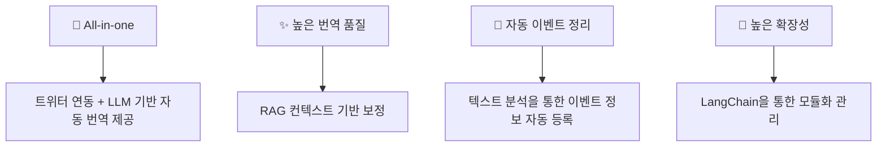

## 📌 오시나비(推しナビ)
## LLM 활용 트위터 일-한 번역 및 이벤트 일정 관리 서비스

---

## 🎯 프로젝트 소개

💡 <b>개발 동기 및 목적</b> (클릭)

| 구분 | 내용 |
|------|------|
| **🎯 Target** | 일본의 아티스트를 응원하는 해외(한국) 팬(이벤터) |
| **❗ Problem** | 1. 정확하지 않은 트위터의 기계식 번역 2. 번역 및 리플라이를 위한 수동 번역기 사용의 번거로움 3. 텍스트 기반 이벤트 정보 제공으로 인한 이벤트 일정 정리의 번거로움 |
| **✅ Solution** | 1. LLM+RAG 기반 문맥 기반 번역 제공으로 보다 자연스러운 번역 제공 2. 리플라이 few-shot 제공으로 상황에 맞는 리플라이 예시 생성  3. 자동 이벤트 정보 추출 및 캘린더 등록  4. 상기 기능이 실제 트위터와 연동될 것 |

### 🌟 프로젝트 특장점

## 💻 기술 스택

### 🖥️ Frontend (Flutter)

   

- **언어 & 프레임워크**: Flutter (>=2.10), Dart (>=2.16)  
- **상태 관리**: Provider  
- **캘린더 UI 컴포넌트**: custom_calendar  

---

### ⚙️ Backend (FastAPI + MySQL)

      

- **언어 & 프레임워크**: Python 3.11+, FastAPI  
- **비동기 ORM**: SQLAlchemy (AsyncSession)  
- **스키마·유효성 검사**: Pydantic (FastAPI 내장)  
- **DB 서버**: MySQL  
- **웹 서버**: Uvicorn  
- **인증·인가**:  
  - JWT (발급·검증 via python-jose)  
- **외부 API 연동**:  
  - Twikit (트윗 스크래핑 / 페이징)  
  - Selenium (t.co URL 해석 용도)  
- **마이그레이션/관리**: Alembic  

---

### 🔒 보안 및 인증

 

- **토큰 기반 인증**: JWT (python-jose)  
- **쿠키 설정**: Secure, HttpOnly, SameSite=None 옵션  
- **API 보안**: FastAPI 의존성 주입 

---

### 🤖 LLM & RAG

      

- **LLM 프레임워크**: LangChain  
- **벡터 검색 / 임베딩**:  
  - FAISS (semantic 검색)  
  - BM25Okapi (lexical 검색; Fugashi 일본어 형태소 분석)  
  - Sentence-Transformers(`all-MiniLM-L6-v2`)  
  - Fugashi (일본어 토크나이저)  
- **모델 API**:  
  - OpenAI(`o4-mini-2025-04-16`)  
  - Claude(`claude-3-7-sonnet`, `claude-3-5-haiku`)  
- **텍스트 전처리·후처리**:  
  - 해시태그/RT 접두사 마스킹 & 복원 (TextMasker)  
  - 이모지 추출 및 복원  
- **파이프라인 구성**:  
  - **TranslationChain**: 마스킹 → LLM 번역 → 마스킹 복원  
  - **ClassificationChain**: 카테고리·제목·상세정보 추출  
  - **ScheduleChain**: 텍스트 내 날짜/시간 추출  
  - **ReplyChain**: 자동 리플라이 생성

---

## 🌳 주요 기능

| 기능 | 설명 | 상태 |
|:------------------------------:|:-----------------------------------------------------------------:|:---:|
| 🔐 **회원가입·로그인 (Auth)** | 이메일/비밀번호 + 트위터 쿠키 기반 검증 → JWT 발급 및 쿠키 저장  |  |
| 🏠 **홈 피드** | 사용자의 최애(오시) 등록 상태에 따라 트윗 목록 표시 및 페이징  |  |
| 💖 **오시 관리** | 트위터 스크린네임 입력 → 트위터 프로필/바이오 정보 표시 및 변경/삭제 기능  |  |
| 📆 **일정 추출 & 등록** | 트윗 메타데이터 추출 → 제목·카테고리·시간 입력 → 일정 등록 (FastAPI ↔ MySQL) |  |
| 📱 **포스트(트윗) 상세·리플라이** | 포스트 본문 & 이미지 그리드 표시 → 리플라이 작성/전송 → 자동 생성 기능  |  |
| 👤 **프로필 조회** | 유저 프로필(이름·스크린네임·팔로워·바이오) 불러오기 & 표시  |  |
| ⚙️ **설정 (Settings)** | 다크 모드 토글 (SharedPreferences), 기타 커스텀 환경설정  |  |
