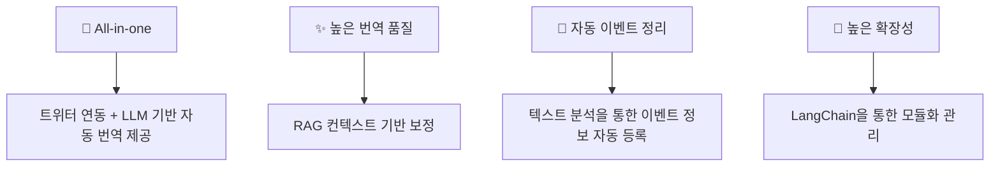
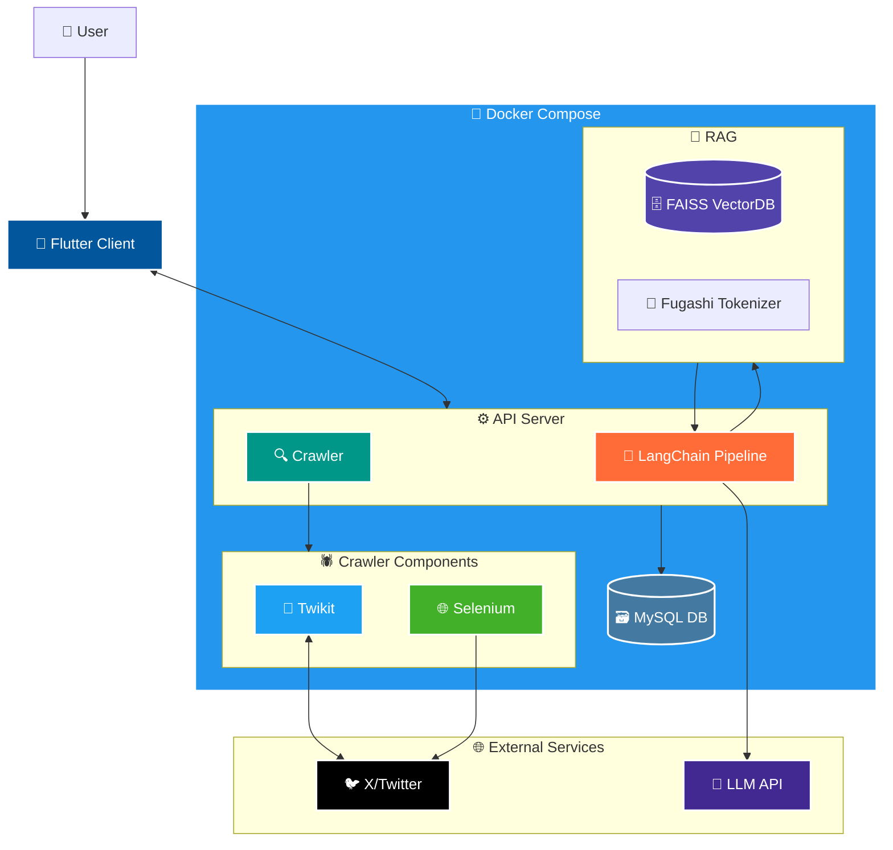
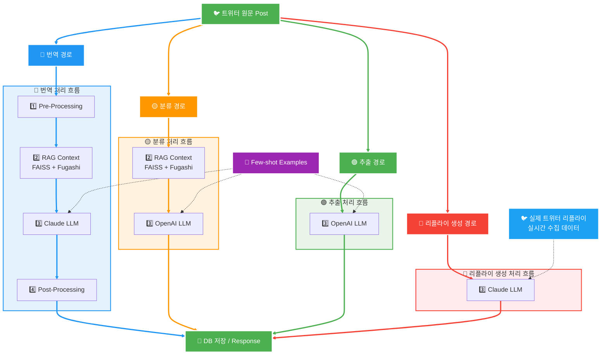
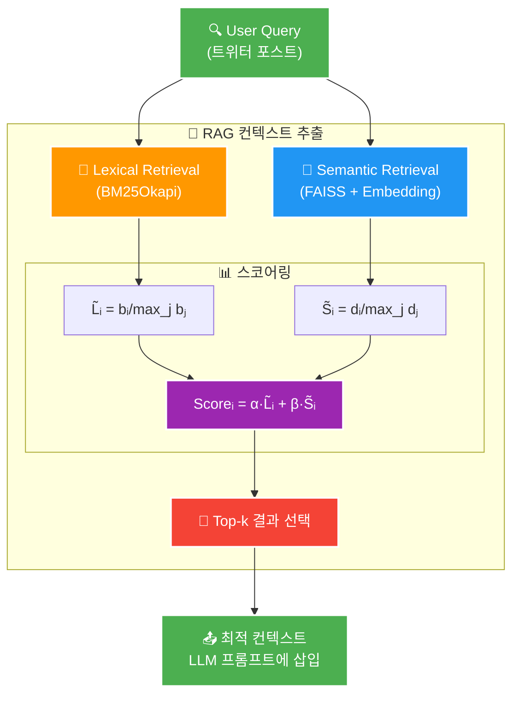
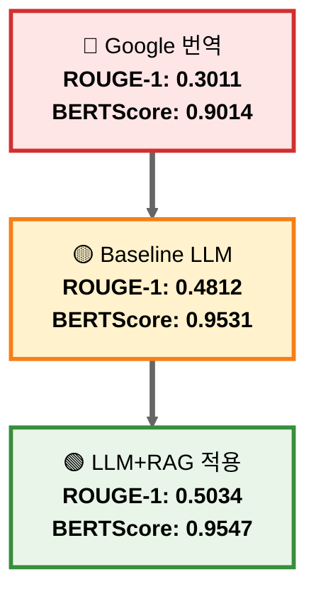

## 📌 오시나비(推しナビ)
## LLM 활용 트위터 일-한 번역 및 이벤트 일정 관리 서비스

---

## 🎯 프로젝트 소개

오시나비는 트위터 기반 정보 제공 및 소통이 이루어지는 일본의 전반적인 아티스트 업계가 갖는 언어 및 정보 장벽을 뛰어넘어, 트위터와 연동되어 문맥 기반 자동 번역을 제공하고 이벤트 일정 자동 분석 및 캘린더 등록 기능을 제공하는 서비스입니다.

💡 <b>개발 동기 및 목적</b> (클릭)

| 구분 | 내용 |
|------|------|
| **🎯 Target** | 일본의 아티스트를 응원하는 해외(한국) 팬(이벤터) |
| **❗ Problem** | 1. 정확하지 않은 트위터의 기계식 번역 2. 번역 및 리플라이를 위한 수동 번역기 사용의 번거로움 3. 텍스트 기반 이벤트 정보 제공으로 인한 이벤트 일정 정리의 번거로움 |
| **✅ Solution** | 1. LLM+RAG 기반 문맥 기반 번역 제공으로 보다 자연스러운 번역 제공 2. 리플라이 few-shot 제공으로 상황에 맞는 리플라이 예시 생성 3. 자동 이벤트 정보 추출 및 캘린더 등록 4. 상기 기능이 실제 트위터와 연동될 것 |

### 🌟 프로젝트 특장점

---

## 🏛️ 시스템 아키텍처

### 🎯 시스템 구성 요소

#### 📱 Client
- **Pull-to-refresh**: 무한 스크롤 적응을 통한 데이터 갱신 접근성 향상
- **Flutter Provider 기반**: 상태관리 / 메모리 캐싱으로 데이터 지속성 유지

#### ⚙️ Server
- **Twikit + Selenium 조합**: 트위터 인증 크롤링 완전 자동화
- **LLM 처리결과와 DB 영속화**: 레이턴시·서버 부하·API 비용 절감
- **Keyset 기반 페이징**: 대용량 데이터 효율적 조회

#### 🤖 LLM Pipeline
- **각 기능을 독립된 LLMChain으로 구현**: (유지보수·기능 확장성)
- **무손실 멀티미디어 전후처리로 번역 중**: 의미왜곡 방지 및 번역 품질 향상
- **RAG 기반 프롬프팅**: 번역 정확도 향상

---

## 🔄 LLM 파이프라인 처리 흐름

### 🔧 LLM 파이프라인 상세 처리 과정

#### 1️⃣ Pre-Processing
- RT 접두사 및 해시태그 마스킹
- 이모지 추출 및 보존

#### 2️⃣ RAG Context Retrieval
- 일본어-한국어 고유명사/신조어 단어쌍을 FAISS VectorDB에 임베딩, RAG 컨텍스트 추출로 관련 top-k개 단어쌍 반환

#### 3️⃣ LLMChain Modules
- 각각의 번역 체인, 분류 체인, 일정 추출 체인, 리플라이 체인은 독립적, 비동기적으로 실행
- 번역, 분류, 일정 추출 체인은 사전에 정의된 Few-shot 예시를, 리플라이 체인은 해당 포스트에 포함된 실제 k개 리플라이를 제공받아 프롬프팅에 사용

#### 4️⃣ Post-Processing
- 전처리 단계에서 마스킹되었던 RT 접두사 및 해시태그 복구
- 누락된 이모지 재삽입

### 🎯 파이프라인 특징

- **🔵 번역**: 전체 4단계 파이프라인으로 문맥 기반+RAG 보정 번역 제공
- **🟡 분류**: RAG 기반 보정으로 정확한 카테고리 분류  
- **🟢 추출**: 직접 LLM 처리로 빠른 일정 정보 추출
- **🔴 리플라이**: 실제 트위터 리플라이 데이터를 Few-shot으로 활용한 자연스러운 응답 생성

### 💡 성능 향상을 위해 사용한 기법

- **문맥 기반 번역**: RAG를 통한 도메인 특화 용어 정확도 향상
- **Few-shot 프롬프팅**: 고품질 번역 예시를 통한 번역 일관성 개선
- **하이브리드 검색**: Lexical + Semantic 검색으로 최적 컨텍스트 제공
- **전후처리 파이프라인**: 해시태그, 이모지 등 멀티미디어 요소 무손실 처리

---

## 🧠 RAG 컨텍스트 추출 과정

### 🎯 하이브리드 검색 알고리즘

| 구분 | 기술 | 설명 |
|------|------|------|
| **📝 Lexical 검색** | **BM25Okapi** | 일본어 형태소(Fugashi) 단위로 토큰화 후, TF-IDF 기반 키워드 유사도 계산 |
| **🔮 Semantic 검색** | **FAISS + Embedding** | all-MiniLM-L6-v2로 쿼리 벡터화 후, FAISS 인덱스에서 코사인 유사도 계산 |
| **⚖️ 점수 정규화** | **Score Normalization** | 각 스코어 정규화 후, 각각에 가중치(α, β) 곱연산 후 더해 최종 점수 산출 |
| **🎯 결과 선택** | **Top-k Selection** | Top-k개 일본어-한국어 어휘쌍 컨텍스트를 반환하여 **프롬프트에 삽입** |

### 💡 핵심 특징

- **이중 검색**: 키워드 매칭과 의미적 유사성을 동시 고려
- **정밀 토큰화**: Fugashi를 통한 일본어 특화 형태소 분석
- **가중치 조절**: α, β 파라미터로 검색 방식 간 균형 조정
- **실시간 처리**: 효율적인 벡터 인덱싱으로 빠른 응답 속도 보장

---

## 📊 번역 성능 평가

### 🎯 성능 비교 결과

LLM+Few-shot prompting과 RAG를 적용하여 일본어-한국어 번역 품질이 크게 개선되었습니다.

### 📈 상세 성능 지표

| 평가 모델 | ROUGE-1 | ROUGE-2 | ROUGE-L | BERTScore F1 |
|:--------:|:-------:|:-------:|:-------:|:------------:|
| **🔴 Google 번역** | 0.3011 | 0.1426 | 0.3005 | 0.9014 |
| **🟡 LLM+Few-shot** | 0.4812 | 0.2488 | 0.4801 | 0.9531 |
| **🟢 LLM+Few-shot+RAG 적용** | **0.5034** | **0.2861** | **0.5030** | **0.9547** |

### 📊 단계별 성능 개선율

| 지표 | Google → Baseline | Baseline → RAG적용 |
|:----:|:-----------------:|:-----------------:|
| **ROUGE-1** | +59.8% | +4.6% |
| **ROUGE-2** | +74.5% | +15.0% |
| **ROUGE-L** | +59.8% | +4.8% |
| **BERTScore F1** | +5.7% | +0.17% |

### 🎯 핵심 성과

- **📊 ROUGE-1**: Google 번역 대비 **67.2% 향상** (0.3011 → 0.5034)
- **📊 ROUGE-2**: Google 번역 대비 **100.6% 향상** (0.1426 → 0.2861) 
- **🧠 BERTScore**: 의미적 유사도 **5.9% 향상** (0.9014 → 0.9547)
- **🎯 RAG 효과**: 특히 ROUGE-2에서 Baseline 대비 **15.0% 추가 향상**
- **⚡ 일관성**: 모든 지표에서 지속적인 성능 향상 확인

---

## 💻 기술 스택

### 🖥️ Frontend (Flutter)

   

- **언어 & 프레임워크**: Flutter (>=2.10), Dart (>=2.16)  
- **상태 관리**: Provider  
- **캘린더 UI 컴포넌트**: custom_calendar

이 프로젝트는 [pickywawa/infinite_calendar_view](https://github.com/pickywawa/infinite_calendar_view)를 포크하여 `custom_calendar/` 폴더에서 직접 수정한 버전을 사용합니다.

**변경된 부분:**
- 날짜 선택 UI 커스터마이징
- 월 전환 애니메이션 개선

---

### ⚙️ Backend (FastAPI + MySQL)

      

- **언어 & 프레임워크**: Python 3.11+, FastAPI  
- **비동기 ORM**: SQLAlchemy (AsyncSession)  
- **스키마·유효성 검사**: Pydantic (FastAPI 내장)  
- **DB 서버**: MySQL  
- **웹 서버**: Uvicorn  
- **인증·인가**: JWT (발급·검증 via python-jose)  
- **외부 API 연동**:  
  - Twikit (트윗 스크래핑 / 페이징)  
  - Selenium (t.co URL 해석 용도)  
- **마이그레이션/관리**: Alembic  

---

### 🔒 보안 및 인증

 

- **토큰 기반 인증**: JWT (python-jose)  
- **쿠키 설정**: Secure, HttpOnly, SameSite=None 옵션  
- **API 보안**: FastAPI 의존성 주입 

---

### 🤖 LLM & RAG

      

- **LLM 프레임워크**: LangChain  
- **벡터 검색 / 임베딩**:  
  - FAISS (semantic 검색)  
  - BM25Okapi (lexical 검색; Fugashi 일본어 형태소 분석)  
  - Sentence-Transformers(`all-MiniLM-L6-v2`)  
  - Fugashi (일본어 토크나이저)  
- **모델 API**:  
  - OpenAI(`gpt-4o-mini-2024-07-18`)  
  - Claude(`claude-3-5-sonnet`, `claude-3-5-haiku`)  
- **텍스트 전처리·후처리**:  
  - 해시태그/RT 접두사 마스킹 & 복원 (TextMasker)  
  - 이모지 추출 및 복원  
- **파이프라인 구성**:  
  - **TranslationChain**: 마스킹 → LLM 번역 → 마스킹 복원  
  - **ClassificationChain**: 카테고리·제목·상세정보 추출  
  - **ScheduleChain**: 텍스트 내 날짜/시간 추출  
  - **ReplyChain**: 자동 리플라이 생성

---

## 🌳 주요 기능

| 기능 | 설명 | 상태 |
|:------------------------------:|:-----------------------------------------------------------------:|:---:|
| 🔐 **회원가입·로그인 (Auth)** | 이메일/비밀번호 + 트위터 쿠키 기반 검증 → JWT 발급 및 쿠키 저장  |  |
| 🏠 **홈 피드** | 사용자의 최애(오시) 등록 상태에 따라 트윗 목록 표시 및 페이징  |  |
| 💖 **최애 관리** | 트위터 스크린네임 입력 → 트위터 프로필/바이오 정보 표시 및 변경/삭제 기능  |  |
| 📆 **일정 추출 & 등록** | 트윗 메타데이터 추출 → 제목·카테고리·시간 입력 → 일정 등록 (FastAPI ↔ MySQL) |  |
| 📱 **포스트(트윗) 상세·리플라이** | 포스트 본문 & 이미지 그리드 표시 → 리플라이 작성/전송 → 자동 생성 기능  |  |
| 👤 **프로필 조회** | 유저 프로필(이름·스크린네임·팔로워·바이오) 불러오기 & 표시  |  |
| ⚙️ **설정 (Settings)** | 다크 모드 토글 (SharedPreferences), 기타 커스텀 환경설정  |  |
